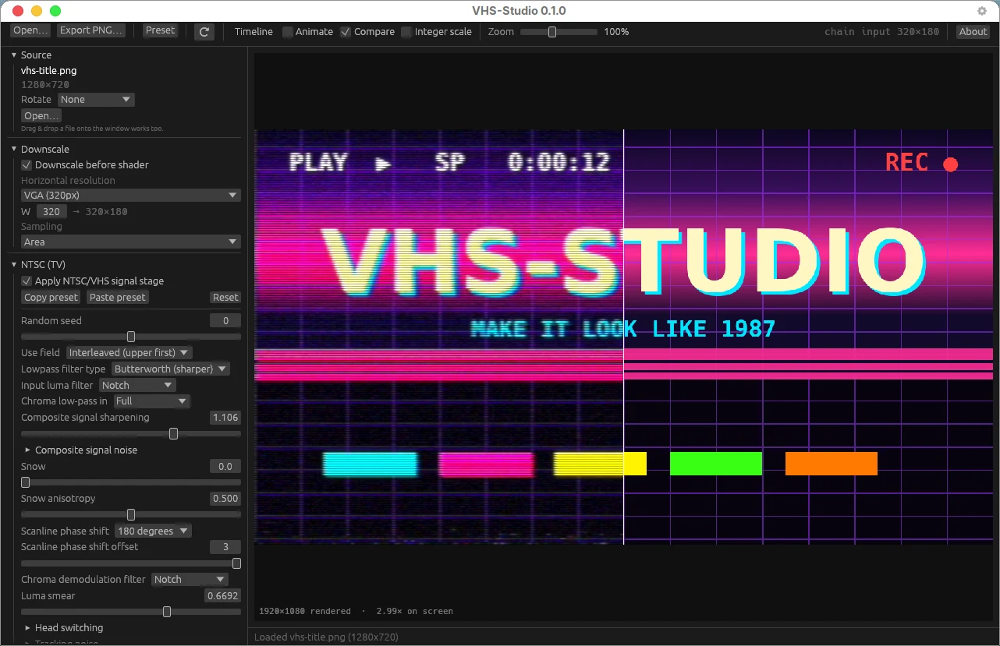

# VHS-Studio



**Make any image or video look like it's playing off a worn tape on a 1980s TV.** VHS-Studio runs your media through a real analog signal emulation ([ntsc-rs](https://github.com/ntsc-rs/ntsc-rs) — composite artifacts, tape noise, head switching, tracking errors), an optional colour grade, and then through RetroArch's CRT shaders (via [librashader](https://github.com/SnowflakePowered/librashader) — scanlines, phosphor masks, glow), on the GPU, for Windows.

```
your image/video → NTSC/VHS signal degradation (full res) → downscale to retro resolution → colour grade → CRT shader → screen / file
```

Full disclosure: **this is two much better projects hacked together, plus a lot of glue.** All of the actual image magic belongs to ntsc-rs and the RetroArch shader community. VHS-Studio is the desktop app that connects them into one pipeline, with video playback, keyframe animation, exports and presets around it.

## Download

Grab `VHS-Studio-<version>-windows-x64.zip` from [**Releases**](../../releases/latest), unzip it anywhere, and run `vhs-studio.exe`. Nothing to install: no runtime, no ffmpeg to find — a pinned FFmpeg is in the zip.

**Requirements:** Windows 10 or 11, 64-bit, with a GPU that supports Direct3D 12 or Vulkan (anything from the last decade). Windows SmartScreen will warn about an unsigned download; choose *More info → Run anyway*.

The **[full guide](windows/README.md)** covers every panel and control. In short:

- **Open** (Ctrl+O) an image (PNG, JPEG, WebP, HEIC, AVIF…) or a video (MP4, MOV, MKV…), or drop one on the window.
- **Presets** — 25 bundled looks from *Clean CRT* to *Obliterated*, including eight colour looks (*Black & white*, *Solarized*, *Inverted*, *Blade Runner*, *Max Headroom*, *Neon*, two colour highlights) and eight that animate. Save your own as JSON.
- **Sidebar** — the pipeline in signal order: Source, Downscale, NTSC (TV) with ntsc-rs's sixty-odd settings, Colour, and CRT with seven RetroArch presets and every runtime parameter.
- **Timeline** — keyframe the entire chain (After Effects-style master keyframes, easing per key) and render the animation; on a video the keyframes pin to moments in the clip.
- **Export** (Ctrl+E) — PNG for stills; H.264/HEVC MP4, ProRes MOV (audio comes along) or GIF for video, at your size and quality, with progress and Cancel. Exports are deterministic.
- **Compare** splits the preview against the untouched source; **Animate** keeps the tape noise moving in the preview at NTSC's 30 fps.

## Where it comes from

VHS-Studio began as the Windows build of [**NTSCRT**](https://github.com/finnmckenty/NTSCRT), Finn McKenty's macOS app that first wired ntsc-rs and librashader together. It owes NTSCRT the pipeline, the house VHS look, the preset format, the keyframe model, the bundled presets and most of its design — and the two still share preset files. SwiftUI and Metal don't exist on Windows, so the app was rebuilt on [wgpu](https://wgpu.rs) and [egui](https://github.com/emilk/egui) in Rust; it then grew things the Mac app doesn't have (the colour-grade stage, bundled ffmpeg, an About box, and so on) and became its own program with its own name.

The macOS NTSCRT app is still in this repository (`Sources/`, `Package.swift`), unchanged; its README is at [docs/README-macOS.md](docs/README-macOS.md), and the upstream project is [finnmckenty/NTSCRT](https://github.com/finnmckenty/NTSCRT).

## Repository layout

| Path | What |
|---|---|
| [`windows/`](windows/) | **VHS-Studio** — the Rust workspace (`vhs-studio-core`, `vhs-studio-app`), presets, packaging script, [README](windows/README.md) and [HANDOFF](windows/HANDOFF.md) |
| `Sources/`, `Package.swift`, `Tests/` | the original NTSCRT macOS app (Swift) |
| `presets/` | the bundled app presets both apps load |
| `Vendor/` | vendored dependencies, including the `slang-shaders` submodule the CRT shaders come from |
| `docs/` | images and the [macOS README](docs/README-macOS.md) |

## Building from source

```powershell
git clone --recurse-submodules https://github.com/scythe000/NTSCRT
cd NTSCRT\windows
cargo build --release
.\target\release\vhs-studio.exe
```

Needs a Rust toolchain (`rustup`, stable) and the Visual Studio Build Tools' C++ workload; the app links the C runtime statically, so the result runs on any Windows machine. `.\package.ps1` stages a release folder with ffmpeg and zips it — the same script CI runs. `vhs-studio-smoke.exe` is a headless verifier that renders frames and reports what it finds, handy for bug reports. See [windows/README.md](windows/README.md#build) for details and [windows/HANDOFF.md](windows/HANDOFF.md) for the whole story of the code.

## Limitations

- The NTSC stage runs on the CPU at your source's full resolution. With **Animate** on, 4K sources drop the preview frame rate; exports render every frame regardless.
- No undo — save a preset before big experiments.
- The download is unsigned, so SmartScreen warns once.
- Not frame-identical to the macOS NTSCRT (different shader runtime backend); deterministic on its own.

## Credits

- [NTSCRT](https://github.com/finnmckenty/NTSCRT) by Finn McKenty — the original app this grew out of
- [ntsc-rs](https://github.com/ntsc-rs/ntsc-rs) — the NTSC/VHS signal emulation (MIT/ISC/Apache-2.0)
- [librashader](https://github.com/SnowflakePowered/librashader) by SnowflakePowered — the RetroArch-compatible shader runtime (MPL-2.0)
- [libretro/slang-shaders](https://github.com/libretro/slang-shaders) and the RetroArch community — the CRT shaders themselves: crt-royale by TroggleMonkey, crt-easymode and crt-aperture by EasyMode, crt-hyllian by Hyllian, crtsim, crtglow (various licenses, largely GPL)
- [FFmpeg](https://ffmpeg.org) — decoding and encoding; the bundled build is from [BtbN/FFmpeg-Builds](https://github.com/BtbN/FFmpeg-Builds) (GPL)
- [wgpu](https://wgpu.rs) and [egui](https://github.com/emilk/egui) — the GPU and UI layers
